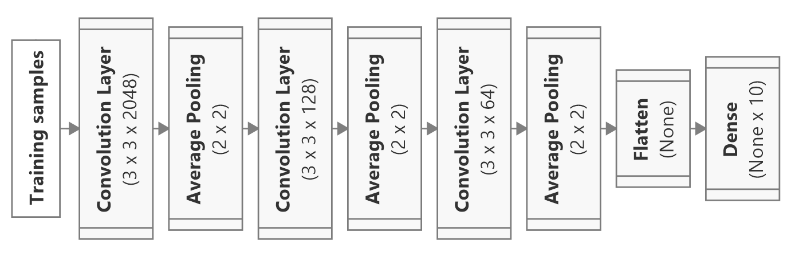

# Deep-Learning-Hardware-Benchmark

## Introduction
This repository contains the proposed implementation for benchmarking to evaluate whether a setup of hardware is feasible for complex deep learning projects.

## Scope
* The benchmark evaluates the performance of a setup having a single CPU, a single GPU, RAM and memory storage. The performance of multi-CPUs/multi-GPUs or server-based is not considered.
* The benchmark is built on the **Anaconda** distribution of Python, and the **Jupyter Notebook** IDE. The deep learning models mentioned in this benchmarked are implemented using Keras.

## Evaluation metrics:
To evaluate the performance, the following metrics are used:
1. **Total execution time**: the **total execution time** includes both the **total training time** and the **total validation time** of a deep learning model on a dataset after a defined number of epochs. Here, the number of epochs is 100. The lower the **total execution time** the better.
2. **Total inference time**: the **total inference time** includes both the **model loading time** (the time required to fully load a set of pre-trained weights to implement a model) and the **total prediction time** of a deep learning model on a test dataset. Similar to the **total execution time**, the lower the **total inference time** the better.
3. **FLOPS**: the performance capability of a CPU or GPU can be measured by counting the number of floating operation points (FLO) it can execute per second. Thus, the higher the **FLOPS**, the better. 
4. **Computing resources issues/errors**: Ideally, a better-performed setup will not encounter any computing resources issues/errors including but not limited to the Out-Of-Memory (OOM) error. 

## Methods
To evaluate the hardware performance, two deep learning models are deployed for benchmarking purpose. The first model is a modified VGG19 based on a study by Deitsch et al. (**Model A**) [1], and the other model is a modified concatenated model proposed in a study from Rahimzadeh et al. (**Model B**) [2]. These models were previously implemented in Vo et al [3]. The model compilation, training and validation practices are similar to those mentioned in Vo et al [3]. Besides, the mixed-precision policy is applied for model training to make it run faster and consume less memory.

Figure 1: Network architecture of **Model A**. This model consists of a **VGG19 convolutional base** followed by four **convolutional layers**, a **Global Average Pooling** layer, and finally three **fully-connected neural** layers (the **Dropout** layers are excluded, but they are still presented in the actual implementation) [3].

Figure 2: Network architecture of **Model B**. This model consists of two separate **convolutional bases** that are **Xception** and **ResNet151V2**, followed by a **concatenated** layer, a **convolutional** layer, a **Global Average Pooling** layer, and finally three **fully-connected neural** layers (the **Dropout** layers are excluded, but they are still presented in the actual implementation) [3]. 

The following datasets for benchmarking are used:
* The **original MNIST dataset** developed by Yann LeCun et al [4].

Figure 3: Visualization of the original MNIST dataset developed by Yann LeCun et al [4].

* The **Zalando MNIST dataset** developed by Han Xiao et al.
Figure 4: Visualization of the Zalando MNIST dataset developed by Han Xiao et al [5].

On the other hand, we also proposed another approach for benchmarking that is much simpler and quicker: evaluating the **total execution time** for a combination of basic operations. These basic operations include General Matrix to Matrix Multiplication (GEMM), 2D-Convolution (Convolve2D) and Recurrent Neural Network (RNN), and exist in almost all deep neural networks today. Table 1 below outlines how these basic operations are applicable in Deep Learning.

Test | Application | 
| ------------ | ------------- |
| Dense Matrix Multiplication (DMM)| Dense Neural Network |
| Sparse Matrix Multiplication (SMM)| Dense Neural Network with Dropout |
| Stacking 2D-Convolution (Convolve2D) | Convolution Neural Network|
| Recurrent Neural Network (RNN) | Dealing with Time Series Data/ Natural Language Processing |

Table 1: Application of basic operations in Deep Learning. 

Below is our description of the alternative benchmark approach:
* In DMM, we defined a matrix C as a product of `(MxN)` and `(NxK)` matrices. For example, `(3072,128,1024)` means the resulting matrix is a product of `(3072x128)` and `(128x1024)` matrices. To benchmark, we implemented five different multiplications, and measured the overall **total excution time** of these five. These multiplications included `(3072,128,1024)`, `(5124,9124,2560)`, `(2560,64,2560)`, `(7860,64,2560)`, and `(1760,128,1760)`.
* In SMM, we defined a matrix C as a product of `(MxN)` and `(NxK)` matrices, and `(100 - Dx100)%` of the `(MxN)` matrix is obmitted. For instance, `(10752,1,3584,0.9)` means the resulting matrix is a product of `(10752x1)` and `(1x3584)` matrices, while 10% of the `(10752x1)` matrix is obmitted. To benchmark, we implemented four different multiplications, and measured the overall **total excution time** of these five. These multiplications included `(10752,1,3584,0.9)`, `(7680,1500,2560,0.95)`, `(7680,2,2560,0.95)`, and `(7680,1,2560,0.95)`.
* In Convolve2D, we defined a simple model containing only convolution layers and pooling layers as in Figure 5, and measured the resulting **total execution time**.
* In RNN, we defined a simple model containing recurrent neural layers as in Figure 6, and measured the resulting **total execution time**.

Figure 5: A simple model containing only convolution layers and pooling layers for the other benchmark approach.

Figure 6: A simple model containing only recurrent neural layers for the other benchmark approach.

## Results
To provide a solid baseline for comparison among different setups, we benchmarked our computing resources and recorded the results. Table 2 below provides the information on our setup. Table 3 provides the results of our benchmark for the **total execution time** on MNIST and Zalando datasets, respectively. Table 4  provides the results of our benchmark for the **total execution time** on GEMM and RNN. Finally, Table 5 provides the results of our benchmark for the **total prediction time**.

| Component |            Setup 1           |           Setup 2          | Setup 3 |
|:---------:|:----------------------------:|:--------------------------:|:-------:|
| CPU       | Core(TM) i7-10750H @2.60 GHz | Core(TM) i7-8665U @1.90GHz |         |
| GPU       | GeForce RTX 2060 5980 MB     | Not Applicable             |         |
| Memory    | 16384 MB RAM                 | 8192 MB RAM                |         |
| Storage   | 476 GB                       | 476 Gb                     |         |

Table 2: Information of the setup used as the baseline for comparison.

| Setup 1 | MNIST (s) | Zalando (s) | FLOPS (10^9) |
|---------|---------------|---------------|-------|
| Model A   | 2317 | 2347 |  0.1155 |
| Model B | <Placeholder> | <Placeholder> |       | 

Table 3: Results of the benchmark on MNIST and Zalando datasets for the 1st setup.

| Setup 1 | MNIST (s) | Zalando (s) | FLOPS (10^9) |
|---------|---------------|---------------|-------|
| Model A   | 2317 | 2347 |  0.1155 |
| Model B | <Placeholder> | <Placeholder> |       | 

Table 4: Results of the benchmark on MNIST and Zalando datasets for the 2nd setup.

| Setup 1 | MNIST (s) | Zalando (s) | FLOPS (10^9) |
|---------|---------------|---------------|-------|
| Model A   | 2317 | 2347 |  0.1155 |
| Model B | <Placeholder> | <Placeholder> |       | 

Table 5: Results of the benchmark on MNIST and Zalando datasets for the 3rd setup.

| Setup 1                  | Excution time (s) | FLOPS (10^9) |
|------------------------------|-------------------|---------------|
| DMM  | 1.74     | N/A |
| SMM | 14.97     | N/A |
| Convolve2D | 217.42     | <Placeholder>  |
| RNN     | <Placeholder>     | <Placeholder> |

Table 6: Results of the benchmark on GEMM, Convolve2D, and RNN for the 1st setup. Because we have not been able to measure the FLOPS count for DMM and SMM, we denoted here as N/A (Not Applicable). 
  
| Setup 2                  | Excution time (s) | FLOPS (10^9) |
|------------------------------|-------------------|---------------|
| DMM  | 3.18    | N/A |
| SMM | 20.34     | N/A |
| Convolve2D | *    | N/A |
| RNN     | <Placeholder>     | <Placeholder> |

Table 7: Results of the benchmark on GEMM, Convolve2D, and RNN for the 2nd setup. Because we have not been able to measure the FLOPS count for DMM, SMM and Convolve2D, we denoted here as N/A (Not Applicable). On the other hand, because the execution time for Convolve2D is significant (>24 hours), we denoted it as *.
  
| Setup 3                  | Excution time (s) | FLOPS (10^9) |
|------------------------------|-------------------|---------------|
| DMM  | 1.74     | <Placeholder> |
| SMM | 14.97     | <Placeholder> |
| Convolve2D | 217.42     | <Placeholder> |
| RNN     | <Placeholder>     | <Placeholder> |

Table 7: Results of the benchmark on GEMM, Convolve2D, and RNN for the 3rd setup.

## Acknowledgements

Contributors: 
* Vinh-Khuong Nguyen (Dr), Associated Lecturer, RMIT Vietnam
* Huynh Quang Nguyen Vo (MSc), Aalto University

## Appendix
1. For the theoretical backgrounds behind GEMM and recurrent network, please refer to the `Theoretical Background.ipynb` file.
2. For the installation of Python, Tensorflow, and other dependencies, please refer to the `Instruction Guide.ipynb` file.

## References
<a id="1">[1]</a> 
S. Deitsch, V. Christlein, S. Berger, C. Buerhop-Lutz, A. Maier, F. Gallwitz, and C. Riess, “Automatic classification of defective photovoltaic module cells in electroluminescence images,” Solar Energy, vol. 185, p. 455–468, 06-2019.

<a id="2">[2]</a>
M. Rahimzadeh and A. Attar, “A modified deep convolutional neural network for detecting COVID-19 and pneumonia from chest X-ray images based on the concatenation of Xception and ResNet50V2,” Informatics in MedicineUnlocked, vol. 19, p. 100360, 2020.

<a id ="3">[3]</a>
H. Vo, “Realization and Verification of Deep Learning Models for FaultDetection and Diagnosis of Photovoltaic Modules,” Master’s Thesis, Aalto University. School of Electrical Engineering, 2021.

<a id ="4">[4]</a>
Y. LeCun, L. Bottou, Y. Bengio, and P. Haffner, "Gradient-based learning applied to document recognition," Proceedings of the IEEE, 1998.

<a id = "5">[5]</a>
Xiao, K. Rasul, and R. Vollgraf, “A Novel Image Dataset for Benchmarking Machine Learning Algorithms,” 2017. https://github.com/zalandoresearch/fashion-mnist

<a id = "6">[6]</a>
F. Pedregosa, G. Varoquaux, A. Gramfort, V. Michel, B. Thirion,O. Grisel, M. Blondel, P. Prettenhofer, R. Weiss, V. Dubourg, J. Vander-plas, A. Passos, D. Cournapeau, M. Brucher, M. Perrot, and E. Duchesnay,“Scikit-learn: Machine learning in Python,” Journal of Machine Learning Research, vol. 12, pp. 2825–2830, 2011.

<a id = "7">[7]</a>
F. Chollet, “Keras,” 2015. https://github.com/fchollet/keras
