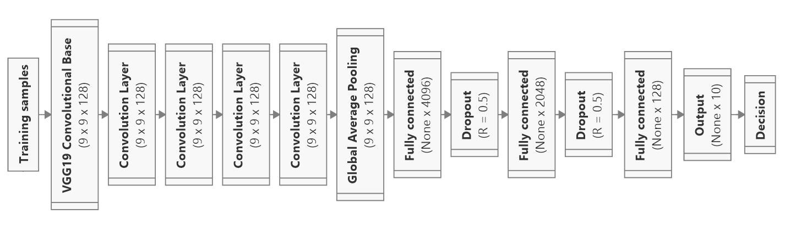
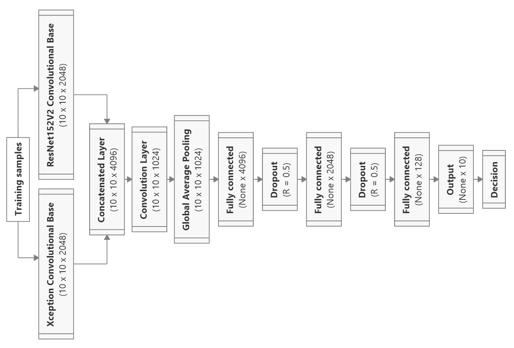

# Deep-Learning-Hardware-Benchmark

## Introduction
This repository contains the proposed implementation for benchmarking to evaluate whether a setup of hardware is feasible for deep learning projects.

This project is the collaboration between Aalto University and RMIT Vietnam.

Authors: Vinh-Khuong Nguyen, Associated Lecturer, RMIT Vietnam
Huynh Quang Nguyen Vo, Doctoral Candidate, Aalto University

## Scope

## Materials and Methods
1. To evaluate the hardware performance, the following metrics are used:
  * The **total execution time** (training + validation time) of a deep learning model on a dataset.
  * (Optional) The **total inference time** (model loading + prediction time) of deep learning on a test dataset.
  * The **presence of potential computing resources error** including but not limited to the Out-Of-Memory (OOM) error.

2. I use the deep learning models from my Master Thesis for benchmarking purpose. The first model is a modified VGG19 based on a study by Deitsch et al. (**Model A**), and the other is a modified concatenated model first proposed in a study from Rahimzadeh et al. (**Model B**).


Figure 1: Network architecture of **Model A**. This model consists of a **VGG19 convolutional base** followed by four **convolutional layers**, a **Global Average Pooling** layer, and finally three **fully-connected neural** layers (the **Dropout** layers are excluded, but they are still presented in the actual implementation).


Figure 1: Network architecture of Model B. This model consists of two **convolutional bases** that are **Xception** and **ResNet151V2**, followed by a **concatenated** layer, a **convolutional** layer, a **Global Average Pooling** layer, and finally three **fully-connected neural** layers (the **Dropout** layers are excluded, but they are still presented in the actual implementation). 

3. I use the following datasets for the benchmark.
* The **original MNIST dataset** developed by Yann LeCun et al.


Figure 3: Visualization of the original MNIST dataset developed by Yann LeCun et al.

* The **Zalando MNIST dataset** developed by Han Xiao et al.
Figure 4: Visualization of the Zalando MNIST dataset developed by Han Xiao et al.


4. Please refer to the `Instruction Guide.ipynb` to install Python, Tensorflow, and other dependencies.

## Results
1. To provide a solid baseline for comparison, I benchmarked my own computing resources and recorded the results. Below is the information on my hardware:

Component | Description
| ------------ | ------------- |
| CPU | Intel(R) Core(TM) i7-10750H @2.60 GHz |
| GPU | NVIDIA GeForce RTX 2060 5980 MB |
| Memory | 16384 MB RAM |
| Storage | 476 GB |

2. The results of my benchmark for the **total execution time** metric are as follows:

Test | Model A (s)| Model B (s)|
| ------------ | ------------- | ------------- |
|Original MNIST | 3758 |
| Fashion MNIST | 3780 |

When running the benchmark on Model B, I encoutered the following issue.
```
W tensorflow/core/common_runtime/bfc_allocator.cc:243] Allocator (GPU_0_bfc) ran out of memory trying to allocate 3.42GiB with freed_by_count=0. The caller indicates that this is not a failure, but may mean that there could be performance gains if more memory were available.
```
This issue is not an error, as mentioned in the message itself, but it is an indicator notifying that the task was too demanding that my GPU could not keep it.

# References
<a id="1">[1]</a> 
F. Pedregosa, G. Varoquaux, A. Gramfort, V. Michel, B. Thirion,O. Grisel, M. Blondel, P. Prettenhofer, R. Weiss, V. Dubourg, J. Vander-plas, A. Passos, D. Cournapeau, M. Brucher, M. Perrot, and E. Duchesnay,“Scikit-learn: Machine learning in Python,” Journal of Machine Learning Research, vol. 12, pp. 2825–2830, 2011.

<a id="2">[2]</a>
F. Chollet, “Keras,” 2015. https://github.com/fchollet/keras

<a id ="3">[3]</a>
Y. LeCun, L. Bottou, Y. Bengio, and P. Haffner, "Gradient-based learning applied to document recognition," Proceedings of the IEEE, 1998.

<a id ="4">[4]</a>
Xiao, K. Rasul, and R. Vollgraf, “A Novel Image Dataset for Benchmarking Machine Learning Algorithms,” 2017. https://github.com/zalandoresearch/fashion-mnist

<a id = "5">[5]</a>
H. Vo, “Realization and Verification of Deep Learning Models for FaultDetection and Diagnosis of Photovoltaic Modules,” Master’s Thesis, Aalto University. School of Electrical Engineering, 2021.

<a id = "6">[6]</a>
S. Deitsch, V. Christlein, S. Berger, C. Buerhop-Lutz, A. Maier, F. Gallwitz, and C. Riess, “Automatic classification of defective photovoltaic module cells in electroluminescence images,” Solar Energy, vol. 185, p. 455–468, 06-2019.

<a id = "7">[7]</a>
M. Rahimzadeh and A. Attar, “A modified deep convolutional neural network for detecting COVID-19 and pneumonia from chest X-ray images based on the concatenation of Xception and ResNet50V2,” Informatics in MedicineUnlocked, vol. 19, p. 100360, 2020.
